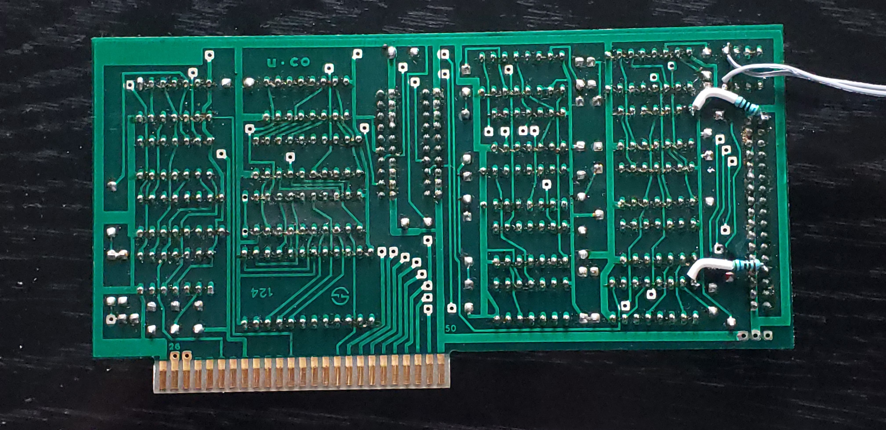

This appears to be a version of Ehring FDC4 controller.

The Ehring FDC4 is described here
https://www.applefritter.com/appleii-box/H085_AppleIIFDC4.htm

#Controller modifications

Originally the only modification was that switch 1 on switch block was turned on, and two wires wewre soldered across it which go to a switch mounted on front panel. This allows switching both drives between 80 and 40 track mode by double-stepping track motor in 40 track mode.

Second modification was adding two pullup resistors pulling up unused INDEX and DRIVE CHANGE lines. Both these signals come our of floppy drives through open collector output which means that no signal will show on them without a pullup. This comes in handy when monitoring the system with oscilloscope and has no other affect since these lines are otherwise unused.

