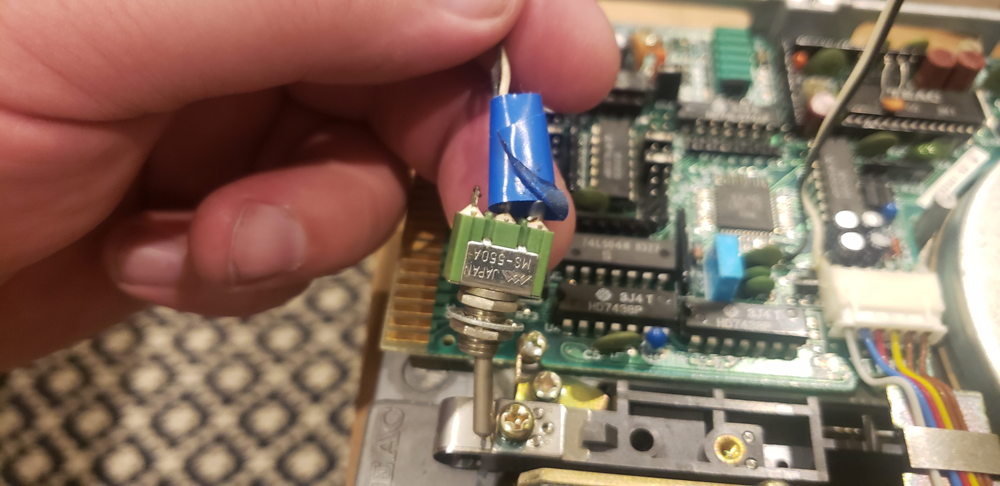

The black/white wire soldered to where R14 used to be as seens in 

goes to a switch with that resistor soldered to it.

This allows switching the drive between 80 and 40 track mode.

Both drives have this modification on them. There also is a switch connected to floppy drive controller which switches both drives between single-sided and double-sided modes.

